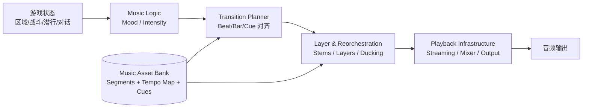
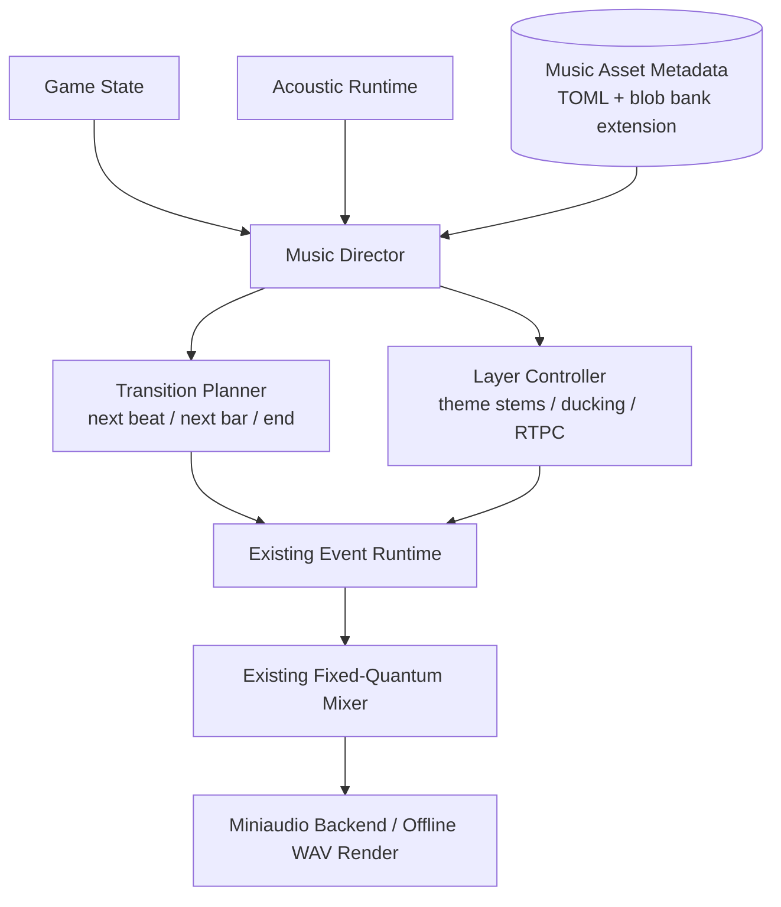
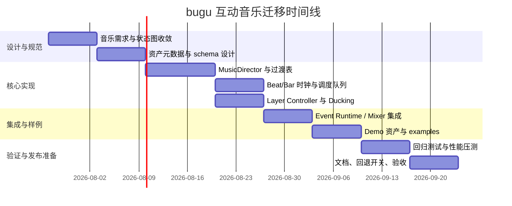

# 在 bugu 仓库中实现类似 KCD 音乐引擎的方案评估报告

**执行摘要：**`bugu` 当前已经具备一个相当扎实的“音频运行时底座”：固定量子 mixer、真实 voice 池、事件运行时、SFX/音乐/主总线、RTPC 音量曲线、空间音频、CPU/GPU 声学传播、离线渲染与验证包装器都已存在；但仓库作者同时明确写明它**尚未产品化**，并把公共 API 稳定性、后端生命周期、资产管线、CI、实时安全审计和压力测试列为下一阶段重点。citeturn17view2turn17view3  
KCD 所代表的不是一个“可直接拿来接入的开源库”，而是一套以 **音乐重排序 + 垂直分层 + 节拍/小节同步切换 + 作曲期元数据** 为核心的自适应音乐设计思想；公开官方资料显示它对应的是 **Sequence Music Engine**，为许可制产品，源码只向 licensee 提供，因此**不宜把“直接采用”理解为直接引入其现成代码**。citeturn18search1turn20search3turn19search0  
结合 `bugu` 的现状，最优路线不是“硬移植 KCD”，而是**在现有事件系统与 mixer 之上新增一个轻量的数据驱动 Music Director 层**：保留 `bugu` 的 Zig-first、固定量子和验证框架，补上 tempo map、transition table、music state graph、layer scheduler 与音乐专用资产元数据。citeturn17view2turn17view3turn22search2turn23search3  
因此，本报告的结论是：**应采用 KCD 的设计原则，但必须做面向 `bugu` 的改造与收敛**；推荐方案是“混合/简化方案”，既能最大化复用 `bugu` 的已有能力，也能避开 KCD 闭源授权、公开 API 不完整和实现细节不可审计的风险。citeturn17view2turn17view3turn18search1turn19search0

## 目录

- `bugu` 仓库音频现状审阅  
- KCD 音乐引擎调研  
- KCD 与其他开源音乐引擎比较  
- 面向 `bugu` 的三种可行实现方案  
- 推荐方案、迁移计划、测试验证与回退策略  

## `bugu` 仓库音频现状审阅

本节以仓库首页、README 中可直接核实的信息为主；由于公开抓取未能稳定展开 `src/` 内部完整树形文件清单，凡无法直接验证到具体文件名的项，均按你的要求标记为“未指定”。仓库首页明确表述 `bugu` 是一个 **Zig-first game audio engine prototype**，聚焦真实运行时音频路径、spatial audio、acoustic propagation、effect routing 与 validation tooling。citeturn2view0turn17view2

### 音频相关文件、目录、模块与接口清单

下表列出当前能从公开仓库页面直接确认的、与音频/音乐最相关的文件和目录。

| 类别 | 文件/目录/接口 | 当前可确认职责 | 备注 |
|---|---|---|---|
| 仓库入口 | `README.md` | 项目定位、能力、约束、验证入口、路线图 | 可直接审阅 |
| 构建入口 | `build.zig` | Zig 构建脚本入口 | 存在，但公开抓取未展开内容，细节未指定 |
| 核心源码目录 | `src/` | Zig engine modules | 具体子文件清单未指定 |
| 示例目录 | `examples/` | 可运行 demo/验证程序 | 由 README 明确提到 `event-demo`、`acoustic-event-demo`、`effect-bus-demo` |
| 验证脚本 | `tools/run_validation.ps1` | CPU/offline validation wrapper，可选 GPU 模式 | 关键验证入口 |
| GPU 声学工具 | `tools/gpu_acoustic_spike/` | 基于 `in-dreaming/gpu` 的 Slang compute spike | 偏声学/加速验证 |
| 交互式可视化工具 | `tools/acoustic_visualizer/` | GPU acoustic ray visualizer + realtime `hello.wav` | 带实时音频回放 |
| 设计文档 | `docs/design/` | 架构与子系统设计 | 具体文档列表未指定 |
| 任务记录 | `docs/tasks/` | 已完成任务与证据链接 | 细节未指定 |
| 验证快照 | `docs/validation/` | 运行结果、验证快照与报告 | README 列出若干报告名 |
| 产品化路线图 | `docs/product-readiness-roadmap.md` | 产品就绪差距与下一步建议 | README 引用 |
| 第三方依赖 | `third_party/`、`third_party_adapters/`、`third_party/in_dreaming_gpu` | 外部依赖与适配层 | 具体文件未指定 |
| 运行时接口 | `postAcousticEvent` | 事件驱动声学运行时入口 | README 直接点名 |
| 运行时接口 | `AcousticEventInstance.update` | 声学事件实例更新 | README 直接点名 |
| 播放抽象 | stable voice handles | 稳定 voice 句柄 | README 直接点名 |
| 运行时能力 | SFX/music/master buses | 基础总线与固定 reverb effect bus | 已存在 |

上述条目综合自仓库首页目录、README 的“Current Capabilities”“Repository Layout”“Quick Start”“Validation”“Product Readiness”等部分。citeturn2view0turn15view0turn15view1turn17view0turn17view3

### 已有音频能力与音乐引擎相关基础

对“要不要做 KCD 风格音乐引擎”来说，`bugu` 现在最重要的不是“有没有音频”，而是“有没有足够好的**宿主层**”。答案是肯定的。README 已证实它有固定量子 mixer、有限真实 voice 池、sample voice 与 test-tone voice、gain ramp、pan、low-pass、pitch、release、SFX/music/master 总线、reverb effect bus、Miniaudio 设备后端、离线 WAV/PCM 渲染、WAV/PCM 资产导入、TOML manifest + float32 blob bank、事件运行时、随机选择、switch 选择、RTPC 音量曲线、stop event、真实 sample voice creation，以及声学映射与空间音频参数。citeturn17view1turn17view2

这意味着 `bugu` 已经具备三类对“音乐导演层”最关键的基础能力。第一类是**稳定时钟与混音执行环境**：固定量子 mixer 与 bounded voice pool 适合做节拍/小节边界调度。第二类是**事件与参数系统**：random selection、switch selection、RTPC curves、stop events 已经接近互动音乐系统的控制面。第三类是**总线与效果路由**：SFX/music/master bus 与固定 reverb effect bus 为音乐分层、ducking、send/return 提供了落点。citeturn17view1turn17view2

### 依赖、平台线索与现有问题

`bugu` 已明确依赖 Zig `0.16.0`、PowerShell（验证包装器）、Git submodules、Miniaudio 设备后端，以及 `third_party/in_dreaming_gpu` 子模块和 Slang compute 路径；GPU/可视化路径还要求等价于 CMake/Ninja/MSVC/SDK 的构建环境。README 同时特别限制，若使用 SDL，必须使用 `in-dreaming/SDL` 指定 fork/branch；视觉工具必须继续使用 `in-dreaming/gpu`，不能再引入第二套临时 window/RHI stack。citeturn15view0turn17view2turn17view3

更关键的是，仓库作者对现状描述得非常直接：项目**尚未 product-ready**；虽已有 CPU/offline validation path 与 GPU acoustic propagation spike，但**public API stability、production backend lifecycle、asset pipeline hardening、CI integration、documentation** 仍需补齐。产品就绪路线图进一步列出七项近期工作：公共 API 与生命周期加固、后端生命周期与 Windows device smoke gate、版本化资产 bank schema 与 failure tests、CI 验证集成、实时安全审计与压力测试、快速开始/集成文档、GPU backend object 与 async readback 设计。citeturn2view0turn17view3

### `bugu` 对 KCD 风格音乐系统的匹配度

从能力映射看，`bugu` 与 KCD 风格系统的关系是“**底盘强、音乐导演层缺位**”。下面这张对照表最能说明问题。

| 维度 | `bugu` 当前状态 | KCD 风格所需能力 | 评估 |
|---|---|---|---|
| 混音底盘 | 已有固定量子 mixer、voice pool、总线、effect routing | 需要稳定可预测的低抖动执行环境 | **已具备** |
| 事件系统 | 已有 event runtime、random/switch、RTPC、stop events | 需要音乐状态机、过渡规则、层控制 | **部分具备** |
| 资产系统 | 已有 WAV/PCM + TOML manifest + blob bank | 需要音乐分段、tempo map、entry/exit cue、layer metadata | **明显缺口** |
| 实时控制 | 已有实时 voice 创建与参数更新 | 需要 beat/bar 对齐、filler 段、延迟切换队列 | **部分具备** |
| 声学耦合 | 已有 acoustic event / mapping / runtime voice updates | 需要把声学状态映射到音乐层强度或滤波 | **有独特优势** |
| 产品稳定性 | README 明确尚未 product-ready | 音乐系统需要高稳定性和一致性验证 | **风险点** |
| 平台目标 | 开发路径可见 Windows/GPU 构建线索；正式目标平台未指定 | KCD 风格方案通常需明确目标平台与音频预算 | **未指定** |

此表完全基于公开仓库说明整理；其中“未指定”对应的是仓库没有明确写出的目标平台、音乐设计目标与最终性能 SLA。citeturn17view2turn17view3

**本节小结：**`bugu` 不是从零开始做互动音乐，而是已经拥有一个很好的 runtime/mixer/event/acoustic 底盘；真正缺的是 **音乐专用元数据、节拍同步调度、过渡规则与可审计的音乐状态图**。因此，实施 KCD 风格方案的关键不在“换底层音频库”，而在于补出一层数据驱动的 Music Director 与音乐资产规范。citeturn17view2turn17view3

## KCD 音乐引擎调研

公开官方资料中，KCD 所依赖的系统名称是 **Sequence Music Engine**。作者 Adam Sporka 的官网把它描述为一个“lightweight adaptive music middleware”，强调用于大型开放世界 RPG、非线性叙事与复杂玩法；而论文摘要则指出，该系统为 KCD 实现了“high-level music logic”与“low-level playback infrastructure”，目标是在保留交响配器特性的同时处理数小时音乐素材、维持相关性并减少重复感。citeturn18search1turn19search0turn19search2

### 公开可确认的 KCD 架构与公开资料边界

最重要的现实边界先讲清楚：Sequence Music Engine **不是开源项目**。官方页面明确写明其许可证按 title 发放，源码只向 licensee 提供，并支持 CryEngine、Unreal Engine、FMOD Studio、Unity 集成，以及 Windows、PS4、PS5、Xbox One、Xbox Series X、JavaScript、Nintendo Switch 等平台。换言之，外部开发者通常只能拿到功能说明，而拿不到可独立审计的公开源码。citeturn18search1turn20search3

因此，本报告对 KCD 的分析分为两层。第一层是**官方/作者公开可确认层**：用途、特性、平台、许可方式、支持复杂 tempo maps、逻辑表达式驱动选择、可定制重排序与重配器。第二层是**基于论文摘要、采访以及你上传的补充调研材料综合还原层**：例如 entry/exit points、Mood + Intensity 双层逻辑、fill segments、Sibelius→Cubase→stems 工作流、同步点对齐和线程/缓冲策略等更细的实现特征；这部分很有启发性，但要明确它不是完整官方 API 文档。citeturn18search1turn19search0turn18search14turn20search0fileciteturn0file0

### KCD 的核心模块、数据流与 API 轮廓

按官方页面，Sequence Music Engine 的核心能力可以概括为五件事：**逻辑表达式驱动选曲、完全可定制的 resequencing、完全可定制的 reorchestration、复杂 tempo map 支持、作者工具可用**。这意味着它不是简单“play/stop/fade”的播放器，而是一个将“音乐结构”和“运行时状态”绑定的音乐中间件。citeturn18search1turn19search11

结合用户上传材料，可将它抽象成以下模块关系：  
- **Music Logic 层**：根据玩家状态、区域、战斗强度等选择当前 mood/scene；  
- **Transition Planner 层**：在合法的 entry/exit cue、beat/bar 边界或 filler segment 上安排切换；  
- **Layer/Reorchestration 层**：在同一主题下做垂直分层，动态增减弦乐、铜管、打击等 stem；  
- **Playback Infrastructure 层**：负责流播、对齐、缓冲与底层输出；  
- **Authoring/Data 层**：由作品片段、tempo map、cue 点、filler 段、逻辑条件和重配器规则组成。 citeturn19search0turn18search1fileciteturn0file0

下面的图把 KCD 风格架构翻译成一个可落到 `bugu` 的抽象形式。



这张抽象图与官方“逻辑表达式驱动选择 + resequencing + reorchestration + complex tempo maps”的能力描述一致，而更细的 `Mood / Intensity / Cue` 语义来自补充研究材料。citeturn18search1turn19search0fileciteturn0file0

### 工作流、数据流、格式支持与实时性

从作者相关资料看，KCD 的音乐创作不是先在中间件里拼片段，而是更靠近传统作曲工作流。你上传的材料把这条链路总结为 **Sibelius 总谱 → MIDI/Cubase → 采样渲染/VSL → stems 导出 → 引擎集成**，并强调在作曲阶段就预设过渡点和逻辑结构。与此同时，Adam Sporka 还有一项名为 **Converdi** 的工具，公开描述为“简化用 Sibelius 写成的音乐生产”，这与“谱面驱动的互动音乐资产化”方向是吻合的。citeturn20search2turn20search0fileciteturn0file0

在**格式支持**方面，官方页面没有像 FMOD/Wwise 那样列出具体容器/编码清单；公开能确认的是它支持“pieces/clips + transition rules + reorchestration + tempo maps”这一层的音乐资产概念，以及多平台集成。也就是说，**公开资料没有给出明确的运行时文件格式矩阵**；更可信的结论是：它要求音乐素材被预处理为带 tempo/cue 元数据的片段与层，而不是简单的一串长音频文件。citeturn18search1turn19search0

在**实时性/延迟**方面，公开官方没有给出硬指标，例如“切换延迟 x ms”“最大同时 stem 数 y”。但从其官方特性“beat-synchronized transitions between pieces”“complex tempo maps support”可知，它至少要求稳定的音乐时钟与对齐调度；你上传材料进一步给出了 entry/exit points、beat/bar/cue 同步点、双缓冲流播以及音频线程实时安全约束的工程化描述，这很适合拿来做 `bugu` 的设计参考，但应清晰标注为补充研究材料而非官方 SLA。citeturn18search1turn20search3fileciteturn0file0

### 插件/扩展机制、优缺点、典型用例与性能指标

公开官方把扩展机制描述得非常清楚：可提供 CryEngine、Unreal、FMOD Studio、Unity 集成，支持自定义平台实现，并向 licensee 提供源码。这意味着它的扩展方式不是“社区插件市场”，而是**授权 + 定制集成**。对于大工作室或需要 dramaturgical design support 的项目，这是优点；对于希望在 MIT 开源仓库中可复用、可审计、可 CI 化的团队，这是明显缺点。citeturn18search1turn20search3

它的**优点**主要有三类。其一，特别适合交响、影视配器、复杂节奏地图和需要“音乐语法不被破坏”的过渡场景。其二，逻辑表达式驱动选曲和垂直重配器非常适合开放世界 RPG。其三，作者工具存在，说明不是纯手写代码系统。其**缺点**同样很鲜明：闭源许可证模式、公开 API/源码不完整、对资产元数据和作者工作流要求高，以及团队必须具备音乐设计与工程协作能力。citeturn18search1turn19search0turn18search14

典型用例方面，官方直接指向“large open-world role-playing games with non-linear story and complex gameplay”；作者站点还说明它已用于《Kingdom Come: Deliverance I/II》以及其他项目。至于**性能指标**，公开官方没有给出 CPU、内存、voice/stem 上限等硬指标；若一定要写进评估，只能如实记作“未公开指定”，并把补充研究材料中的预算视为**非官方工程参考**。citeturn18search1turn20search3fileciteturn0file0

**本节小结：**KCD 的价值不在于“有一个可直接引入的开源库”，而在于它证明了**交响配器也能做复杂互动音乐**。对 `bugu` 最有价值的不是复用其闭源实现，而是吸收其四个核心思想：**作曲期元数据化、节拍同步切换、片段重排序、垂直重配器**。citeturn18search1turn19search0fileciteturn0file0

## KCD 与其他开源音乐引擎比较

为了把“类似 KCD 的方案”落到工程决策上，不能只看 KCD 本身，还要看它与**可公开获取的开源方案**之间的差异。这里选取三个参考对象：**Godot AudioStreamInteractive**、**Kira**，以及与 `bugu` 现有实现强相关的 **miniaudio**。其中 Godot 更像“内建互动音乐容器”，Kira 更像“表达性游戏音频库”，miniaudio 则是“跨平台底层音频库”。citeturn23search3turn22search2turn21search2

### 引擎对比表

下表综合了官方文档、项目主页、GitHub 页面或对应官方文档站的公开信息；KCD/Sequence Music Engine 因闭源许可，不列“开源社区活跃度”，改列“许可/可获取性”。citeturn18search1turn19search0turn23search0turn23search3turn22search0turn22search2turn21search2

| 方案 | 架构取向 | 核心功能 | 性能与实时性 | 可扩展性 | 学习曲线 | 社区/可获取性 | 与 `bugu` 的关系 |
|---|---|---|---|---|---|---|---|
| **KCD / Sequence Music Engine** | 高层音乐逻辑 + 低层播放基础设施；以 resequencing/reorchestration 为中心 | 逻辑表达式驱动选曲、定制重排序、定制分层、复杂 tempo map、作者工具 | 官方未公开硬指标；强调 beat-synced transitions 与 orchestral-friendly 切换 | 可集成 CryEngine/Unreal/FMOD/Unity；自定义平台可做 | 高；需要音乐设计与工程协同 | **闭源许可制**，源码只给 licensee | 最像目标能力，但不能直接拿代码 |
| **Godot AudioStreamInteractive** | 以 clip + transition table 为核心的互动音乐流资源 | `add_transition()`、clip 数组、过渡规则、beat/bar/end 同步、filler clip、hold previous | 有节拍/小节同步过渡；适合剪辑切换，但不是完整音乐中间件 | 在 Godot 内很好扩展；脱离 Godot 复用性弱 | 中；概念清晰，上手快 | Godot 主仓库约 113k 星、2026-05 仍在发布稳定版，社区强 | 最适合借鉴“最小可行互动音乐 API” |
| **Kira** | backend-agnostic 的游戏音频库 | tweens、mixer、effects、clock system、spatial audio、`AudioManager`/`SoundData` | 官方强调精确 timing 与流畅参数变化；性能依 backend/构建优化 | Rust 生态扩展性强，适合自建中层逻辑 | 中 | lib.rs 显示 2025-06 仍有新版本、月下载量较高 | 最适合借鉴“时钟 + 可表达控制层” |
| **miniaudio** | 单文件跨平台底层音频库 | 播放/采集、解码、节点图、资源管理、部分 3D、WAV/FLAC/MP3 等 | 以轻量、跨平台、低依赖见长；不自带高层音乐导演系统 | 非常强，适合作为底层 backend | 低到中 | GitHub 星数高、平台广、活跃稳定 | `bugu` 已在使用；应继续作为底层而非音乐导演层 |

表中关于 Godot 的过渡 API、同步点和 filler clip 来自其官方类文档；关于 Kira 的 clock system、mixer、timing 与 API 轮廓来自其官方文档/包索引；关于 miniaudio 的单文件、跨平台、节点图和解码能力来自其官方仓库说明。citeturn23search3turn23search11turn22search2turn22search7turn22search9turn22search0turn21search2

### 关键差异解读

如果把“像 KCD”拆成三个层次，就更容易判断技术选型。第一层是**底层音频 I/O 与 mixer**，miniaudio 已经覆盖。第二层是**时钟、参数平滑、总线/效果与可表达播放控制**，Kira 提供了成熟思路。第三层是**音乐状态图、分段切换、beat/bar 对齐与 filler 片段**，Godot 的 `AudioStreamInteractive` 给出了一个公开、简单、很适合参考的 API 轮廓。KCD 则把这三层全部打包成更偏“作品实现工具链”的整体。citeturn21search2turn22search2turn23search3turn18search1

对 `bugu` 而言，最合理的路线不是“引入一个替代底层库把 miniaudio 换掉”，因为 `bugu` 现阶段的缺口并不在底层设备后端；它真正缺的是**第三层**，也就是高层 Music Director 与音乐专用资产元数据。换句话说，`bugu` 更应向 **KCD 学目标、向 Godot 学接口收敛、向 Kira 学时钟与参数表达**，而不是另起炉灶重做底层。citeturn17view2turn17view3turn23search3turn22search2turn18search1

**本节小结：**KCD 是目标形态，Godot 给出“最小互动音乐 API”的公开范式，Kira 给出“精确时钟与表达性控制”的实现思路，miniaudio 则继续当 `bugu` 的底层后端即可。这个比较本身已经暗示推荐方向：**在 `bugu` 现有 miniaudio + event runtime 上，加一层面向音乐的状态机和过渡表**。citeturn17view2turn23search3turn22search2turn21search2

## 面向 `bugu` 的三种可行实现方案

由于 KCD 本体闭源许可，下面的“方案一”中的“直接移植/集成 KCD 风格方案”，应理解为**直接复刻其设计范式并尽可能贴近其功能轮廓**，而不是接入其私有源码。这个前提很重要，因为许可模式本身就是第一风险源。citeturn18search1turn20search3

### 方案一

**方案定义：**在 `bugu` 现有 runtime 之上新增一个较完整的 `MusicDirector` 子系统，目标能力接近 KCD/Sequence Music Engine：segment graph、entry/exit cue、tempo map、beat/bar 对齐、filler segment、垂直分层、ducking、Music RTPC、music-state logic、authoring metadata。该方案最接近 KCD 的“音乐中间件化”方向。citeturn18search1turn19search0fileciteturn0file0

**实现步骤：**  
先扩展资产模型，为现有 TOML manifest + blob bank 增加 `music_segments`、`layers`、`tempo_map`、`entry_cues`、`exit_cues`、`filler_segments`、`state_rules`。然后在 `src/` 中新增或拆分一个音乐导演层，负责从游戏状态解析目标 music state，并把请求排入“下一拍/下一小节/下一 cue”执行队列。再往 mixer/event runtime 里增加 music-specialized voice group 和 layer scheduler，使其能一次性管理同主题下多 stem 同步与进退场。最后在 `examples/` 增加 `music-state-demo` 与 `combat-explore-transition-demo`，在 `tools/run_validation.ps1` 中补入音乐切换回归。citeturn17view2turn17view3

**需改动文件/模块：**

| 位置 | 改动说明 |
|---|---|
| `src/` | 新增音乐导演层、transition planner、tempo/cue 数据结构；具体文件名未指定 |
| `src/` 现有 mixer/event/runtime 模块 | 扩展 music-specific 调度与 layer 共享时钟；具体文件名未指定 |
| 资产导入路径 | 扩展 TOML manifest 与 bank schema，增加 music metadata；具体文件名未指定 |
| `build.zig` | 增加音乐 demo/测试 target；具体内容未指定 |
| `examples/` | 新增互动音乐 demo |
| `tools/run_validation.ps1` | 增加音乐状态与节拍同步验证 |
| `docs/design/` | 增加音乐状态图、资产 schema、实时线程约束文档 |
| `docs/validation/` | 增加音乐路径快照与报告 |

**评估：**工作量 **高**。风险包括：授权概念误读导致设计过度贴近闭源产品、资产工作流过重、`bugu` 现有非 product-ready 状态放大复杂度、tempo/cue 元数据不成熟导致“功能很多但作者难以正确使用”。性能影响上，CPU 与内存压力主要来自多 stem 同步与 transition scheduling，但在 `bugu` 固定量子 mixer 架构下是可控的；兼容性上，若把该层做成可选 feature，能保持与当前 SFX/event runtime 基本兼容。citeturn17view2turn17view3turn18search1

### 方案二

**方案定义：**做一个**混合/简化版 KCD 风格系统**。保留 KCD 最有价值的三项：`music state graph`、`beat/bar synced transition`、`vertical layering`；但先**不做**复杂 tempo map、和声兼容推理、filler segment 编辑器，也不追求“一口气做成完整中间件”。这本质上是“先把 80% 价值做出来”的路线。citeturn18search1turn23search3turn22search2

**实现步骤：**  
第一步，把音乐资产限制为 **固定 BPM + 拍号 + 简单 cue 集**，从而降低资产制作难度。第二步，在现有 event runtime 上新增 `MusicState`（例如 `Explore`/`Tension`/`Combat`/`DialogueDuck`）和 `MusicTransitionRule`，仅支持 `immediate / next_beat / next_bar / end` 四类 transition timing。第三步，把每个主题最多限制为 3–4 层 stem，用现有 bus/RTPC 做分层淡入淡出。第四步，把 `AcousticEventInstance.update` 输出的环境信息可选映射到音乐层强度、低通或 reverb send，这会成为 `bugu` 相比一般音乐引擎的差异化优势。citeturn17view2turn17view3turn23search3fileciteturn0file0

**需改动文件/模块：**

| 位置 | 改动说明 |
|---|---|
| `src/` | 新增轻量 `MusicDirector` 与 `MusicTransitionRule`；具体文件名未指定 |
| 现有 event runtime | 复用 switch/RTPC，补一个 music state 通道；具体文件名未指定 |
| 现有 asset import/bank | 增加简化 music metadata；具体文件名未指定 |
| `examples/` | 新增 `music-basic-demo`、`music-layer-demo` |
| `tools/run_validation.ps1` | 加入 beat/bar 切换与分层回归 |
| `docs/design/` | 增加简化版互动音乐设计文档 |

**评估：**工作量 **中**。风险最低，因为它最大化复用仓库已有能力，并避免在 `bugu` 尚未稳定前引入过于沉重的 authoring 系统。性能影响较小，兼容性最好，也最适合先做桌面/服务器默认目标，再视需要扩到浏览器/移动。代价是功能上不如完整 KCD 风格方案，尤其在复杂 tempo map 和精细过渡上会有所取舍。citeturn17view2turn17view3turn18search1turn22search2turn23search3

### 方案三

**方案定义：**不模仿 KCD 的“片段-重排序中心”，而是做一个更适合 `bugu` 的**声学驱动音乐架构**。核心思想是把 `bugu` 已有的 acoustic propagation 和 room/probe/material/portal 数据作为音乐控制的一级输入，让音乐更多通过**层、滤波、send、时值密度与微分段**变化，而不是高度依赖大量手工切碎的片段。这是一种“创新替代架构”。citeturn17view2turn17view3

**实现步骤：**  
先定义 `AcousticMusicProfile`，把房间体积、遮挡、材质、路径长度、危险等级等映射为音乐参数：层密度、低通截止、reverb send、节奏活跃度、ostinato 开关、stinger 触发阈值。再让事件系统驱动“主题切换”，而让声学层驱动“主题内部演化”。最后给音乐资产添加更少但更长的 loop/stem 组合，而不是大量 entry/exit cue；必要时只在少数 Theme 间使用 beat/bar 同步切换。citeturn17view2turn17view3fileciteturn0file0

**需改动文件/模块：**

| 位置 | 改动说明 |
|---|---|
| `src/` | 新增 `AcousticMusicMapper` 或同类模块；具体文件名未指定 |
| 声学运行时与 event runtime | 扩展参数外发与音乐联动；具体文件名未指定 |
| mixer/bus/effects | 增强 send/filter/ducking 映射；具体文件名未指定 |
| 资产 schema | 增加 `theme + layers + acoustic mappings` |
| `examples/` | 新增“房间开门/关门影响音乐”的 demo |
| `docs/design/` | 记录 acoustic-to-music 规则集 |

**评估：**工作量 **中到高**。它不是最像 KCD 的方案，但可能是**最像 `bugu` 自己**的方案。风险在于：音乐设计师接受度未必高，因为它对作曲与实现协同方式的要求更特殊；同时它需要更强的调优与可视化工具支持。性能方面，它可能比方案一更省资产体积，但调参成本会更高。兼容性方面，与仓库现有声学路线最一致。citeturn17view2turn17view3

### 三方案总表

| 方案 | 目标 | 工作量 | 主要优点 | 主要风险 | 性能影响 | 兼容性影响 |
|---|---|---|---|---|---|---|
| 方案一 | 高拟真 KCD 风格完整复刻 | 高 | 能力最强、最接近目标形态 | 复杂、授权语义易误解、资产生产压力大 | 中等到较高 | 中等 |
| 方案二 | 简化版 KCD 风格，先做核心 80% | 中 | 性价比最高、最容易落地、最适合当前仓库成熟度 | 复杂过渡与 tempo map 功能先天受限 | 低到中 | 最好 |
| 方案三 | 声学驱动的 `bugu` 特化音乐架构 | 中到高 | 最有差异化，能放大 `bugu` 现有声学优势 | 调参难度大，团队认知成本更高 | 中 | 中到较好 |

为了说明方案二的实现要点，下面给出一个更接近 `bugu` 风格的伪代码。这个伪代码的精神来自 KCD 的状态图和节拍对齐思想，但数据结构特意收敛成可在 `bugu` 现有事件/总线体系中落地的样子。citeturn17view2turn23search3turn22search2turn18search1

```zig
const MusicState = enum {
    explore,
    tension,
    combat,
    dialogue_duck,
};

const TransitionSync = enum {
    immediate,
    next_beat,
    next_bar,
    end_of_segment,
};

const MusicTransitionRule = struct {
    from: MusicState,
    to: MusicState,
    sync: TransitionSync,
    fade_beats: f32 = 1.0,
    filler_segment: ?u32 = null,
};

const MusicDirector = struct {
    current_state: MusicState,
    requested_state: ?MusicState = null,
    beat_clock: BeatClock,
    rules: []const MusicTransitionRule,

    pub fn request(self: *MusicDirector, next: MusicState) void {
        self.requested_state = next;
    }

    pub fn update(self: *MusicDirector, audio_quantum_frames: u32) void {
        self.beat_clock.advance(audio_quantum_frames);

        if (self.requested_state) |next| {
            const rule = lookupRule(self.current_state, next, self.rules);
            if (self.beat_clock.canTransition(rule.sync)) {
                applyLayerFadeForState(next, rule.fade_beats);
                scheduleSegmentSwitch(next, rule.filler_segment);
                self.current_state = next;
                self.requested_state = null;
            }
        }
    }
};
```

**本节小结：**如果把“应否采用 KCD 方案”理解成“是否应直接照搬完整 KCD 式中间件”，答案是否定的；若理解成“是否应吸收其设计思想并在 `bugu` 上实现收敛版”，答案是肯定的。三种方案里，**方案二最平衡，方案三最有 `bugu` 特色，方案一最强但也最重**。citeturn18search1turn17view2turn17view3

## 推荐方案、迁移计划、测试验证与回退策略

### 推荐结论

推荐采用 **方案二：混合/简化版 KCD 风格方案**。理由有四点。第一，`bugu` 已有 mixer、event runtime、bus、RTPC、离线验证和声学映射，做轻量 Music Director 的边际成本最低。第二，KCD/Sequence Music Engine 本身是许可制闭源产品，不适合把“采用”理解为集成现成源码。第三，Godot `AudioStreamInteractive` 的 clip/transition 表与 Kira 的 clock/tween 思路都证明：**高价值的互动音乐能力其实可以用相对小的公开 API 面来承载**。第四，`bugu` 现在最需要的是把现有底盘做稳，而不是再引入一个过重的作者工具链。citeturn17view2turn17view3turn18search1turn23search3turn22search2

一句话结论就是：**采用 KCD 的思想，改进为 `bugu` 自己的实现，不采用其闭源产品形态。**这既回答了“是否应采用”，也回答了“是否应改进”：应改进，而且必须改进。citeturn18search1turn20search3turn17view3

### 推荐目标架构

建议的落地架构如下。它不替换 `bugu` 现有底层，而是在其上增加一个可选的音乐逻辑层。



这个结构最大限度复用了 `bugu` 现有部件：`event runtime` 继续做播放请求与 stop control；`fixed-quantum mixer` 继续做真实运行时混音；`Miniaudio backend` 继续做设备输出与离线渲染；新增的只是在其上层的 **Music Director / Transition Planner / Layer Controller / Music Metadata**。这正是“少改底层、多补控制面”的思路。citeturn17view2turn17view3

### 迁移计划与时间估算

下面给出一个偏保守、适合当前仓库成熟度的 10 周迁移计划。它不是“发布日期承诺”，而是一个便于研发组织的工程估算。



若团队较小，建议把里程碑划成四个验收门：  
**里程碑一**：能在两段 loop 间按下一拍/下一小节切换。  
**里程碑二**：能在同一主题下做 3–4 层 stem 的垂直分层。  
**里程碑三**：能把至少一个 `AcousticEvent` 或游戏状态映射到音乐强度。  
**里程碑四**：能通过验证包装器稳定回归，并在离线渲染中重现同样的切换顺序。  
这些门槛都与 `bugu` 当前“validation-first”的风格一致。citeturn17view3

### 测试与验证方法

测试应分为四层，而不是只听感验收。  
**功能层**：验证状态切换、ducking、分层淡入淡出、filler/无 filler 两种路径、停止/恢复、同主题重入。  
**时序层**：验证所有切换确实发生在 `beat/bar/end` 所声明的边界上；离线渲染结果应能通过事件日志与波形对齐检查复现。  
**性能层**：建议至少采集音频线程 CPU 时间、活跃 voice/stem 数、buffer underrun 次数、切换请求到实际生效的延迟、资产预热与切换时瞬时内存峰值。  
**稳定性层**：在长时压力测试中反复切换 `Explore ↔ Tension ↔ Combat ↔ DialogueDuck`，确保不分配、不卡锁、不做文件 I/O、不产生 silent fallback，这与 README 中的实时线程约束完全一致。citeturn17view3

工具方面，最应该复用的是仓库现有验证包装器 `tools/run_validation.ps1`、离线 WAV 渲染路径、event/bank playback、effect bus routing 与已有验证报告目录。建议再新增三类输出：  
一类是**transition trace**，记录状态请求时刻、合法执行边界、实际执行边界；  
一类是**layer trace**，记录各 stem 音量包络；  
一类是**golden offline render**，用于二进制或波形对比。  
这样做的好处是，音乐系统不再只是“听上去差不多”，而是能被 CI 和离线测试真正抓住回归。citeturn17view3

### 回退策略

回退策略必须在第一版就设计，不要等系统复杂后再想。建议这样做：  
其一，把新音乐系统放在一个显式 feature flag 后面，例如 `music_director_v1`。关闭这个开关时，项目仍使用现有 event runtime + music bus 的普通播放路径。  
其二，资产层保留双轨兼容：旧版 manifest 不含音乐元数据时，按普通 sample/event 处理；新版 manifest 才启用音乐状态图。  
其三，运行时保留“降级到固定 loop + RTPC 分层”的安全路径；如果 transition planner 失效，不应让音频中断，而应退到最简单的主题循环。  
其四，在发布前把离线 golden render 和运行时 trace 同时接入验证脚本，使回退判断从“听感主观”改为“事件和波形可验证”。citeturn17view2turn17view3

### 最终结论

如果目标是“在 `bugu` 里做出**类似 KCD** 的音乐引擎体验”，答案不是采购或移植一个现成闭源中间件，而是：  
**在 `bugu` 现有 Zig-first 音频底盘上，自建一个简化而严格数据驱动的互动音乐层。**  
这个层应该吸收 KCD 的 resequencing、layering、tempo/cue 同步思想，借鉴 Godot 的 transition table API 设计，参考 Kira 的 clock/mixer 控制思想，但继续依托 `bugu` 现成的 miniaudio、事件运行时、离线渲染和声学校验路径。这样做既合乎当前仓库的技术现实，也最可能在中短期内得到一个能测、能调、能扩展的结果。citeturn18search1turn19search0turn23search3turn22search2turn21search2turn17view2turn17view3

关于 KCD 细部实现（如 Mood/Intensity、Entry/Exit、Fill Segments、流播与实时安全约束）的更细解释，本文还参考了你上传的补充调研材料。fileciteturn0file0