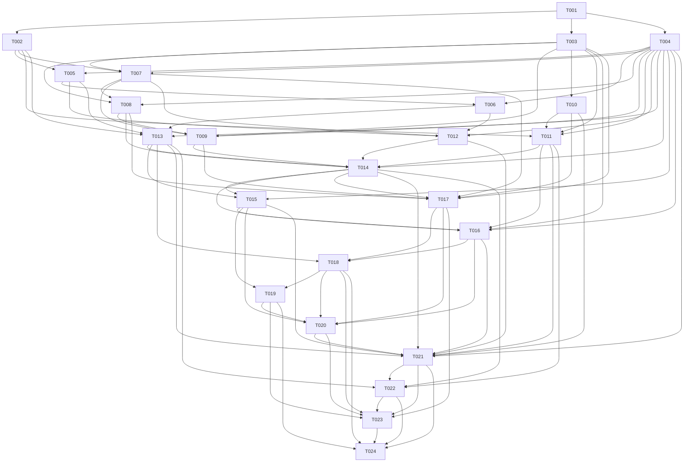

# Bugu SME v1 实施上下文

状态：ACTIVE
最后更新：2026-07-24
适用范围：`docs/tasks_sme/` 下全部任务
唯一产品终点：完整 Bugu Sequence Music Engine v1

## 1. 项目与目标

Bugu 是 Zig-first 游戏音频引擎 prototype。当前仓库已经具有 fixed-quantum mixer、64 个 real voice、稳定 voice handle、WAV/PCM preload bank、event/switch/RTPC、SFX/Music/Master bus 标签、固定 reverb effect bus、miniaudio/offline backend、空间音频、CPU/GPU 声学传播与验证脚本。

本任务集要在这些真实基础之上交付完整 SME v1，使游戏可以提交 state、parameter、context、stinger 和 duck 请求，由引擎完成：

- 复杂 tempo/meter map 和 sample-accurate transport；
- 水平重排序、条件选择、sequence/shuffle/no-repeat/history；
- entry/exit cue、fill route 和兼容性求解；
- 多 stem 原子启动、垂直重配器、real/virtual voice；
- Ogg Opus streaming、seek、loop、prefetch 和 emergency recovery；
- Bus DAG、automation ducking 和真实 signal sidechain；
- 生命周期、save/restore、hot reload、rollback；
- Zig 作者工具、`in-dreaming/gpu` 图形化 authoring 与 runtime debugger；
- 确定性 trace/replay、真实 demo、CI、设备与 8 小时压力验证。

SME v1 是完整 release，不是 MVP。TASK-001 至 TASK-024 全部完成且最终 gate 通过之前，不得把任何中间状态称为 SME v1。

### 成功标准

1. `MusicRequest -> Director -> TransitionPlan -> ScheduledCommandBlock -> Mixer -> Device/Offline PCM` 是真实主路径。
2. 所有 transition 的实际 frame 等于计划 frame；同一 group 必需 stems 的 start/cursor skew 为 0。
3. tempo map、cue/fill、logic、selector、reorchestration、streaming、sidechain、authoring 和 hot reload 都有真实实现与失败测试。
4. nominal matrix 的 command overflow、stream underrun、dropout 为 0。
5. 相同 bank、seed、save state 和 request trace 得到 bit-identical schedule trace。
6. headless validation、GPU UI smoke、真实设备 smoke 和至少 8 小时压力 gate 通过。
7. 不存在 stub、固定结果、外部播放器、静默 fallback 或把 preload 冒充 streaming 的路径。

## 2. 事实来源

### 2.1 架构与约束

- `docs/design/arch_sme.md`：SME v1 范围、模块、数据、线程、错误、验收和 ADR 的权威来源。
- `docs/research/kcd.md`：水平重排序、垂直分层、entry/exit、fill 和创作工作流来源。
- `docs/research/kcd.sme.md`：Bugu 现状评估。其“先做简化版”建议已被 `arch_sme.md` 的完整 v1 决策覆盖。
- `docs/tasks/asetup.md`：Zig、submodule、实时安全、fallback、anti-mock 和 `in-dreaming/gpu` 硬约束。
- `docs/design/audio-runtime-contract.md`：Game/Control/Worker/Render 线程边界。
- `docs/design/audio-engine-design.md`：现有 L0-L9、mixer、bank、event、bus 与性能方向。
- `docs/product-readiness-roadmap.md`：当前 prototype 限制与 release gate。

执行者只需完整阅读本文件与当前任务文件。上列文件用于追溯，不得把重新阅读它们作为完成当前任务所需的隐藏前提。

### 2.2 当前代码事实

| 路径 | 已确认职责与限制 |
|---|---|
| `src/core/engine.zig` | `EngineConfig` 默认 48 kHz/256 frames/stereo；直接拥有 mixer；无绝对 render-frame scheduler |
| `src/mixer/mixer.zig` | 64 real voices；mono sample 到 stereo；gain/pan/filter/pitch/reverb send；无 atomic group、virtual voice、Bus DAG |
| `src/assets/bank.zig` | WAV PCM 导入为单声道 48 kHz float32；未版本化 TOML + blob；全量 preload |
| `src/events/runtime.zig` | 即时 play/switch/RTPC/stop；不能保证音乐边界或多 stem 同步 |
| `src/device/device.zig` | miniaudio 与 offline backend；fixed-quantum adapter |
| `src/acoustic/acoustic.zig` | CPU reference acoustic response 与 mixer mapping；只能作为可选音乐参数输入 |
| `src/bugu_audio.zig` | 当前公共 Zig module 汇总入口 |
| `build.zig` | 单体构建入口；已有 unit test、demos 和 acoustic visualizer |
| `.gitmodules` | 已有 miniaudio 与 `in_dreaming_gpu`；尚无 libogg/libopus |
| `third_party_adapters/` | 已有 miniaudio、gpu adapter；尚无 codec adapter |
| `tools/run_validation.ps1` | 当前 CPU/offline gate 与显式 GPU acoustic gate |

现有命令：

```powershell
zig build test
powershell -ExecutionPolicy Bypass -File tools\run_validation.ps1
zig build acoustic-visualizer-smoke
```

任务中标注“新增命令”的命令只有在对应任务完成后才可使用。

### 2.3 文档与实现差异

`arch_sme.md` 是目标 contract，不代表代码已实现。当前缺失：绝对 frame command block、multichannel、atomic group、virtual voice、tempo map、Music Director、cue/fill planner、Opus/streaming、Bus DAG/sidechain、MusicRuntime、music bank、作者工具和 SME 验证。任务不得把设计类型名当作已存在接口。

## 3. 当前架构

当前调用链：

```text
Game/demo
  -> EventRuntime 或直接 Engine API
  -> Engine.start/update/stop voice
  -> Mixer.render(fixed quantum)
  -> MiniaudioBackend 或 OfflineBackend
```

当前资产链：

```text
WAV PCM
  -> importToBank
  -> 未版本化 TOML + mono float32 blob
  -> loadBank 全量加载
  -> SoundRef.samples
```

当前不变量：

- render thread 无 allocation、lock、file I/O、log formatting、GPU wait、lazy load；
- GPU 声学是加速候选，CPU 是 correctness reference；
- 第三方必须是 git submodule；
- 引擎主体必须是 Zig；
- 可视工具必须使用 `in-dreaming/gpu`；
- fallback 必须运行真实降级路径并显式报告。

## 4. 目标架构与统一约定

### 4.1 目标数据流

```text
Game/API
 -> bounded MusicRequestQueue
 -> Music Director + Logic + Selector History
 -> TempoClock + Transition Planner
 -> Prefetch Coordinator + Layer Controller
 -> immutable ScheduledCommandBlock
 -> Mixer VoiceGroup + Bus DAG
 -> Device/Offline

Worker/I/O -> codec/decode/stream completions -> Control
Render -> execution receipts/atomics -> Control
Control -> trace/replay/telemetry -> tools/CI
Authoring -> shared schema/compiler/runtime preview -> compiled MusicBank
```

### 4.2 冻结模块和新增路径

以下路径是计划新增路径；任务文件会指定唯一所有者：

```text
src/music/
  root.zig
  ids.zig
  errors.zig
  contract.zig
  trace.zig
  clock.zig
  logic.zig
  selector.zig
  director.zig
  planner.zig
  layers.zig
  runtime.zig
  stinger.zig
  acoustic_mapping.zig
  save_state.zig
src/mixer/
  channel_layout.zig
  music_group.zig
  virtual_voice.zig
  bus_graph.zig
  sidechain.zig
src/assets/
  music_bank.zig
  music_schema.zig
src/streaming/
  music_stream.zig
  prefetch.zig
third_party_adapters/
  opus/
tools/sme_compiler/
tools/sme_authoring/
tools/sme_debug/
examples/sme/
tests/sme/
docs/validation/sme/
```

实际实现可在 TASK-001 的契约审查中做无行为差异的路径微调，但必须同步本文件和全部受影响任务，不能各任务自行发明第二套命名。

### 4.3 ID、版本和错误

- 公共 ID：FNV-1a 64，bank build 时检测 hash collision。
- Bank：`major.minor`；major 不兼容拒绝，minor 由 capability bits 检查。
- 整包：SHA-256 content hash + monotonic generation。
- 每个 `Engine` 一个主 `MusicRuntime`/transport。
- 错误集基线：`InvalidState`、`InvalidHandle`、`InvalidBankVersion`、`UnsupportedCapability`、`InvalidMusicGraph`、`InvalidTempo`、`MisalignedStems`、`TransitionNotFound`、`TargetNotResident`、`VoiceBudgetExceeded`、`CommandQueueFull`、`StaleAssetGeneration`、`StreamUnderrun`、`UnsupportedOperation`。
- render thread 只写固定计数/receipt，不格式化错误文本。

### 4.4 时间与调度

- 唯一权威时钟是 `u64 render_frame`。
- 作者 tempo 使用 PPQ + milli-BPM；compiler 生成整数 `BeatGrid`、`BarGrid`、`TempoSpan`、`CueTable`。
- runtime 不用 `f32` 累加 beat phase。
- transition 使用严格下一个边界；紧急 stop 例外且必须短 ramp。
- 同 frame 命令按 `(execute_frame, sequence)` 稳定排序。
- 同一 transition 的 group command 原子入队；容量不足整组失败。

### 4.5 音乐领域对象

- `MusicState`：互斥主状态。
- `Theme`：作品/配器集合。
- `Segment`：可 loop/跳转的音乐时间段。
- `Layer`：共享 segment cursor 的 stem。
- `Intensity`：连续重配器输入，不复制 state。
- `MusicCue`：entry/exit/both/stinger/fill entry/fill exit。
- `FillRoute`：source exit 到 target entry 的零到多个 fill segments。
- `SegmentSelector`：fixed/sequence/weighted random/shuffle/no-repeat/condition/history。
- `MusicVoiceGroup`：必需 layers 原子 start/seek/stop，共享 cursor/loop epoch。

### 4.6 线程和所有权

| 线程 | 允许 |
|---|---|
| Game | 提交 bounded request，读取上一 snapshot |
| Audio Control | Director、clock lookup、planner、prefetch、自动化编译、trace |
| Worker/I/O | bank、codec、decode、stream、非实时校验 |
| Audio Render | immutable command、group cursor、DSP/mix、atomic telemetry |
| GPU/tool | authoring/debug；不得成为 transport 或 render 依赖 |

`MusicBank` 拥有 metadata/blob/stream descriptors；`MusicRuntime` 持有 generation lease；group/voice 只能引用稳定 generation。hot reload 原子发布新 generation，旧 generation 延迟回收。

### 4.7 Codec、channel 和 streaming

- v1 必需 Resident PCM 与 Ogg Opus。
- `libogg`、`libopus` 必须作为 submodule，Zig adapter 隔离第三方类型。
- channel layout：mono、stereo、5.1、7.1、显式 mask。
- Opus 必须处理 pre-skip、end padding、sample-accurate seek 和 loop。
- 长 segment 强制 streaming；worker 填充预分配 ring；render 不解码。
- 必需 layer underrun 进入显式 degraded/emergency 状态，不能让其他 stem 静默继续。

### 4.8 Authoring 和可视化

- 作者源：版本化 TOML project + 独立音频文件。
- compiled binary bank 是唯一 runtime 输入。
- CLI 与 GUI 共享 schema/compiler/director/planner/validation。
- GUI 使用 `in-dreaming/gpu`，不引入第二套窗口/RHI。
- headless CI 始终可运行，不依赖 GPU。

### 4.9 状态协议与证据

任务状态仅允许 `待实施`、`实施中`、`阻塞`、`待审查`、`完成`。只有完成定义全部满足并记录真实命令/输入/输出，才可标记完成。

每个任务实施后在其文档追加：

```markdown
## 实施证据
- Commit:
- Commands:
- Inputs:
- Results:
- Failures/limits:
- Acceptance mapping:
```

## 5. 实施范围

### 范围内

- `arch_sme.md` 中全部 SME v1 能力；
- 必要的现有 mixer/engine/bank/device/event 重构；
- codec submodule、authoring/debug tooling、demo、CI、文档和 qualification；
- 旧 event/bank 的兼容与显式迁移。

### 范围外

- DAW/谱面/波形编辑器；
- 生成式作曲、实时 MIDI/VST；
- 运行时音频和声分析；
- sample-level GPU mixer；
- 网络/多人音乐同步；
- 与 SME 无关的声学 solver 扩展。

## 6. 任务总览

| ID | 标题 | 交付结果 | 硬依赖 | 波次 |
|---|---|---|---|---:|
| TASK-001 | [SME 公共契约与模块骨架](task-001-sme-contract-module-seams.md) | 冻结 ID/error/API/thread/source tree，建立可编译 module seam | 无 | 0 |
| TASK-002 | [绝对帧调度与 command block](task-002-absolute-frame-scheduler.md) | quantum 内 sample-offset、原子 command group、receipt | 001 | 1 |
| TASK-003 | [版本化 MusicBank 与 compiler core](task-003-versioned-music-bank.md) | v1 tables/capabilities/hash/TOML parse/校验 | 001 | 1 |
| TASK-004 | [Trace、telemetry 与 replay contract](task-004-trace-telemetry-replay.md) | 结构化 trace、atomic counters、deterministic replay format | 001 | 1 |
| TASK-005 | [Multichannel mixer 与 MusicVoiceGroup](task-005-multichannel-voice-groups.md) | mono/stereo/5.1/7.1、原子 group、0 stem skew | 002,004 | 2 |
| TASK-006 | [Virtual voice 与平台预算](task-006-virtual-voice-budgets.md) | music virtualize/realize、保护类、drop rank、profile | 004,005 | 3 |
| TASK-007 | [Tempo/meter compiler 与 Clock](task-007-tempo-map-clock.md) | ramp/meter/pickup/loop grid、frame/tick/bar 查询 | 002,003,004 | 2 |
| TASK-008 | [Logic、Director 与 SegmentSelector](task-008-logic-director-selectors.md) | bounded bytecode、仲裁、sequence/shuffle/history | 003,004,007 | 3 |
| TASK-009 | [Cue/Fill Transition Planner](task-009-cue-fill-transition-planner.md) | entry/exit/fill/compatibility 联合求解与计划 | 003,004,007,008 | 4 |
| TASK-010 | [Ogg Opus codec adapter](task-010-ogg-opus-adapter.md) | submodules、decode、pre-skip、seek、loop | 003 | 2 |
| TASK-011 | [Streaming、prefetch 与 seek](task-011-streaming-prefetch-seek.md) | ring/cache/watermark、group readiness、emergency | 002,003,004,010 | 3 |
| TASK-012 | [Layer Controller 与重配器](task-012-layer-reorchestration.md) | intensity/context 驱动 layer/variant/filter/send/bus | 004,005,006,007 | 4 |
| TASK-013 | [Bus DAG 与真实 sidechain](task-013-bus-dag-sidechain.md) | 编译 bus graph、detector/compressor、meter | 002,004,005,006 | 4 |
| TASK-014 | [MusicRuntime 端到端集成](task-014-music-runtime-integration.md) | 公共 API、生命周期、save/restore、真实主链 | 004,008,009,011,012,013 | 5 |
| TASK-015 | [Stinger、ducking 与声学映射](task-015-stinger-duck-acoustic.md) | stinger scheduler、automation duck、acoustic profile | 004,013,014 | 6 |
| TASK-016 | [Hot reload、generation 与 rollback](task-016-hot-reload-rollback.md) | lease、迁移、旧 voice 安全、rollback | 003,004,011,014,015 | 7 |
| TASK-017 | [Headless authoring 与 CLI compiler](task-017-headless-authoring-cli.md) | project import/edit validate/build/preview core | 003,007,008,009,010,014 | 6 |
| TASK-018 | [GPU 作者应用](task-018-gpu-authoring-app.md) | graph/timeline/cue/fill/layer 编辑、preview/live tuning | 013,016,017 | 8 |
| TASK-019 | [Runtime 可视调试器](task-019-runtime-visual-debugger.md) | transport/candidate/layer/bus/stream/trace 视图 | 015,018 | 9 |
| TASK-020 | [完整 SME 示例项目与 demo](task-020-complete-sme-demo.md) | 真实 bank/stream/state/fill/sidechain/hot reload 演示 | 015,016,017,018,019 | 10 |
| TASK-021 | [全量自动验证与 replay/CI](task-021-full-validation-replay-ci.md) | unit/integration/golden/failure matrix、wrapper、CI | 004,010,011,012,013,014,015,016,020 | 11 |
| TASK-022 | [实时安全、设备与 8 小时压力 gate](task-022-realtime-device-stress.md) | RT audit、Windows device、长时无 dropout/underrun | 011,013,014,021 | 12 |
| TASK-023 | [Packaging、迁移和用户文档](task-023-packaging-migration-docs.md) | release package、legacy migration、author/runtime guides | 017,018,019,020,021,022 | 13 |
| TASK-024 | [SME v1 产品资格审查](task-024-v1-product-qualification.md) | 逐项证据矩阵和唯一 release verdict | 018,019,021,022,023 | 14 |

## 7. 依赖图与执行波次



执行波次：

- 波次 0：TASK-001。
- 波次 1：TASK-002、TASK-003、TASK-004 可并行。
- 波次 2：TASK-005、TASK-007、TASK-010 可并行。
- 波次 3：TASK-006、TASK-008、TASK-011 可并行。
- 波次 4：TASK-009、TASK-012、TASK-013 可并行。
- 波次 5：TASK-014。
- 波次 6：TASK-015、TASK-017 可并行；两者只能通过 TASK-014 的稳定扩展点集成。
- 波次 7：TASK-016。
- 波次 8：TASK-018。
- 波次 9：TASK-019。
- 波次 10：TASK-020。
- 波次 11：TASK-021。
- 波次 12：TASK-022。
- 波次 13：TASK-023。
- 波次 14：TASK-024。

### 共享文件所有权

| 共享位置 | 所有者与合并顺序 |
|---|---|
| `src/bugu_audio.zig` | TASK-001 建 seam；TASK-014 导出 runtime；TASK-023 做 release surface 收口 |
| `src/core/engine.zig` | TASK-002 scheduler；TASK-014 runtime ownership；TASK-016 generation lifecycle，依赖顺序已串联 |
| `src/mixer/mixer.zig` | TASK-002 command seam；TASK-005 multichannel/group；TASK-006 virtualization；TASK-013 Bus DAG，依赖顺序已串联 |
| `src/assets/bank.zig` | TASK-003 仅添加兼容桥；TASK-016 generation/hot reload；旧 bank 行为不得被其他任务重写 |
| `build.zig` | TASK-001 建 `addSmeSteps` 扩展点；之后仅 TASK-010、017、018、019、020、021 按依赖顺序追加 |
| `tools/run_validation.ps1` | TASK-021 唯一功能所有者；TASK-022 只增加被脚本调用的独立 stress 工具，TASK-023 不改 gate |
| `tools/sme_authoring/` | TASK-017 core/CLI；TASK-018 UI；TASK-019 不得在此目录实现 runtime debugger |
| `docs/validation/sme/` | 各任务写唯一命名 artifact；TASK-021 建索引，TASK-024 只读取并出 qualification report |

## 8. 全局验收标准

### 8.1 功能

- 支持 multi-region tempo ramp、meter change、pickup、cue 和 loop closure。
- 支持 fixed/sequence/weighted/shuffle/no-repeat/history selector。
- 支持 source exit、零到多 fill、target entry 和 compatibility tags。
- 支持 multichannel stem、atomic group、virtualization、完整 layer target。
- 支持 Opus streaming/seek/loop、prefetch 和 emergency segment。
- 支持 automation duck 与真实 dialogue sidechain。
- 支持 stinger、acoustic parameter mapping、save/restore、hot reload/rollback。
- CLI、GUI authoring、runtime 和 offline preview 使用同一逻辑。

### 8.2 实时与确定性

- render path 无 alloc/lock/I/O/log/GPU wait/codec decode。
- 同组必需 stem skew 为 0。
- schedule trace 跨重复运行 bit-identical。
- nominal 8 小时 gate 无 dropout、underrun、overflow、leak 或 stale generation use。
- late worker/GPU 结果不阻塞 transport。

### 8.3 兼容和失败

- 旧 event/WAV bank 继续运行。
- 不兼容 bank/capability/hash/ID collision 明确失败。
- malformed tempo/cue/fill/logic/seek/channel 拒绝构建或加载。
- 队列/voice/stream 资源不足按 contract 返回错误或真实 degraded path。
- GPU UI 不可用时 headless gate仍可运行，但 TASK-018/019/024 不能因此完成。

### 8.4 证据

- 每项能力有 unit + integration + failure case。
- validation artifacts 包含命令、输入、输出、版本、commit、机器/设备信息。
- 最终 TASK-024 逐条引用证据，不以“之前任务标记完成”代替复验。

### 8.5 架构能力追踪

| `arch_sme.md` 能力 | 实现所有者 | 集成/验证所有者 |
|---|---|---|
| 公共API、ID、错误、线程边界 | 001 | 014、023、024 |
| 绝对frame、quantum内命令、原子发布 | 002 | 005、014、021 |
| 版本化bank/capability/hash | 003 | 016、017、021 |
| trace/telemetry/replay | 004 | 019、021、024 |
| multichannel与MusicVoiceGroup | 005 | 012、020、021 |
| virtual voice和平台预算 | 006 | 012、020、022 |
| tempo/meter/pickup/loop grid | 007 | 009、017、021 |
| logic/director/selector/history | 008 | 014、020、021 |
| entry/exit/fill/compatibility planner | 009 | 014、017、020、021 |
| Resident PCM + Ogg Opus | 010 | 011、020、021 |
| streaming/prefetch/seek/emergency | 011 | 014、020、022 |
| 完整重配器 | 012 | 014、020、021 |
| Bus DAG/automation/sidechain | 013 | 015、020、021 |
| lifecycle/save/restore/device恢复 | 014 | 020、021、022 |
| stinger/duck/acoustic mapping | 015 | 020、021 |
| hot reload/migration/rollback | 016 | 018、020、021 |
| headless authoring/compiler/preview | 017 | 020、021、023 |
| GPU authoring application | 018 | 020、023、024 |
| runtime visual debugger | 019 | 020、023、024 |
| 完整示例项目 | 020 | 021、023 |
| 自动化/golden/replay/CI | 021 | 022、024 |
| RT/device/8小时压力 | 022 | 023、024 |
| package/migration/docs | 023 | 024 |
| 最终release verdict | 024 | 024 |

## 9. 未决事项与假设

当前没有需要用户先行决定的产品范围问题；`arch_sme.md` 第 16 节已经冻结 ownership、queue、channel、codec、pause/device、author source、bank/hash、determinism、sidechain 和 UI。

实现时仍需通过任务内验证确定但不改变架构的工程参数：

| 参数 | 当前处理 | 最迟冻结 |
|---|---|---|
| libogg/libopus commit | 使用官方 `xiph/ogg`、`xiph/opus` submodule，选择能在 Zig 0.16 + Windows/Linux gate 通过的固定 commit | TASK-010 |
| platform voice/stream budgets | 通过 `PlatformProfile` 数据化，不写死全局值 | TASK-006/TASK-011 |
| tempo compiler 误差阈值 | 必须小于 1 sample anchor error，loop 闭合为 0 frame error | TASK-007 |
| sidechain preset defaults | 以测试信号无 click、可复现为准；作者资产可覆盖 | TASK-013 |
| 8 小时 gate 机器 | Windows 支持矩阵中的真实设备机器，记录硬件/driver | TASK-022 |

这些参数由指定任务的真实测试收敛，不构成把功能延期出 v1 的理由。
